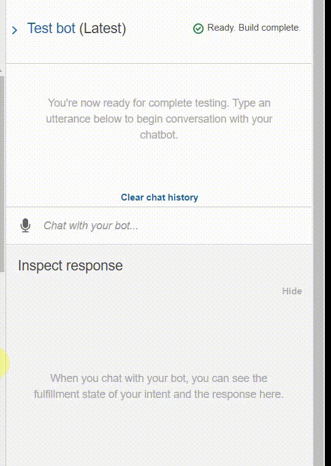

# Conversational User Interface

**Currently in Alpha Phase**

A user interface that parallels human conversation. Utilizing Natural Language Processing & Artificial Intelligence. Built to provide real-time statistical analysis for the [datasets](https://github.com/eml33530/Project_2/tree/main/Resources) featured in this project.

## Roadmap

Alpha Phase - Started May 2021 ***in progress***

Beta Phase - To Be Anounced

## 3-Steps Activation

**Step 1** Say "Hello"

**Step 2** Answer "Yes" or "No" 😈

**Step 3**  Ask Your Question

## Current Features

- Greeting Recognition - This friendly bot response to pleasant greetings!
- Top-Five TV Series - Setup you month by finding the top-five best TV Series!
- Best Recommendation - "Pick the year & I'll give you the best TV Series!" ~ a friendly bot
- Reviewer - Powered by IMDb, this bot provides rapid IMDb results to assist in your next binge!
- Text & Voice based logic - You choose to speak or type!

## Demo

#### Contact: [Orlando K. Fuller Jr](https://github.com/OrlandoFuller)
